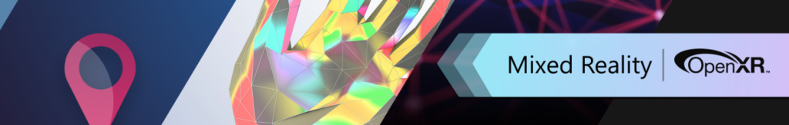

# What is the Microsoft OpenXR plugin?
The Microsoft OpenXR plugin is an Unreal Engine game plugin which provides additional features
available on Microsoft's Mixed Reality devices like the HoloLens 2 when using OpenXR.
OpenXR is an open royalty-free API standard from Khronos that provides engines with native access to
a wide range of devices from vendors across the mixed reality spectrum. While Unreal Engine supports
OpenXR natively, some additional functionality specific to Microsoft's Mixed Reality platforms is
only available through this plugin.

| NOTE: The Microsoft OpenXR plugin requires **Unreal 4.26.0+**. |
| --- |

# Feature Summary

Unreal Engine 4.26 with OpenXR provides the following built-in functionality:
* Eye tracking
* Hand joint tracking
* Hand and controller input action mapping

The Microsoft OpenXR plugin provides the following additional functionality:
* Keyboard input routing
* Dynamic hand mesh rendering
* Spatial anchoring
* Holographic Remoting from the PC
* Photo/Video (PV) camera access
* QR code tracking
* Spatial mapping providing a mesh of the physical world
* Voice input
* Azure Spatial Anchors
* Secondary View Configuration (requires 4.26.2+)

If you're new to Mixed Reality development in Unreal, visit the
[Unreal development journey](https://docs.microsoft.com/windows/mixed-reality/unreal-development-overview)
in the Microsoft Docs. The Unreal development journey is specifically tailored to walk new developers
through the installation, core concepts, and usage of the Microsoft OpenXR plugin.

# Installation

## Installing the plugin from the Unreal Marketplace

1. Install the [Microsoft OpenXR](https://www.unrealengine.com/marketplace/en-US/product/ef8930ca860148c498b46887da196239) plugin from the Unreal Engine Marketplace to your engine. 
1. Open Unreal Engine, go to **Project Settings** > **Plugins** and search for "Microsoft OpenXR". Verify that the plugin has been enabled. You may need to restart the engine for changes to take effect. 

# Feedback and contributions
This project welcomes contributions and suggestions. Most contributions require you to agree to a Contributor License Agreement (CLA) declaring that you have the right to, and actually do, grant us the rights to use your contribution. For details, visit https://cla.microsoft.com.

When you submit a pull request, a CLA-bot will automatically determine whether you need to provide a CLA and decorate the PR appropriately (e.g., label, comment). Simply follow the instructions provided by the bot. You will only need to do this once across all repos using our CLA.

This project has adopted the Microsoft Open Source Code of Conduct. For more information see the Code of Conduct FAQ or contact opencode@microsoft.com with any additional questions or comments.